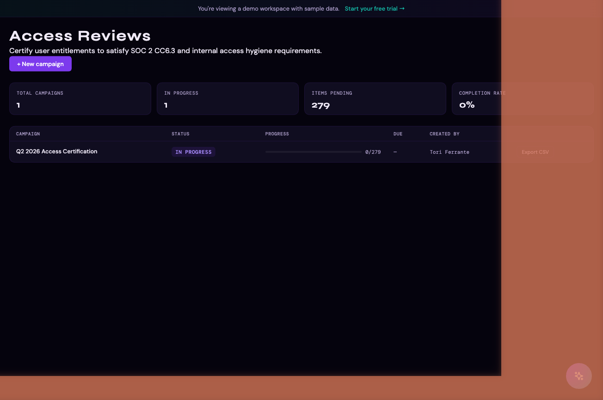
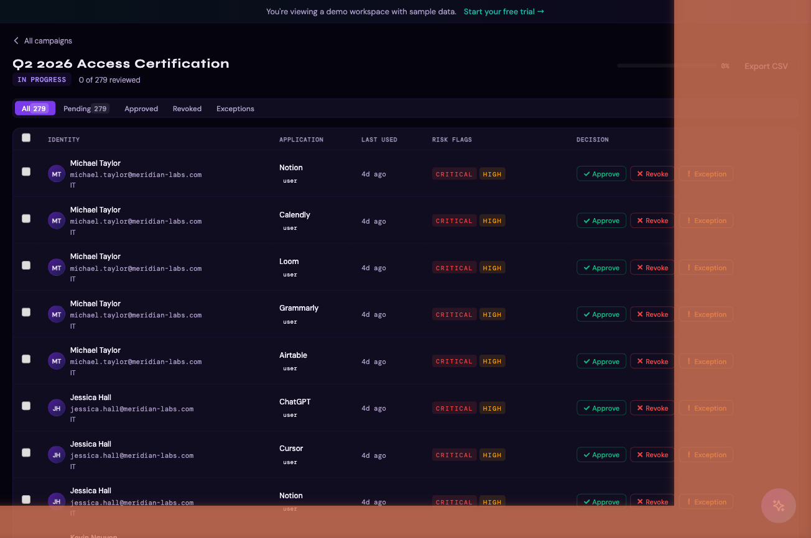

# Access Reviews

Access Reviews let you run structured user access certification campaigns — a formal process where your team reviews every identity-to-application entitlement and makes an explicit approve, revoke, or exception decision for each one.

---

## What is an access review?

An access review (also called an access certification or entitlement review) is a periodic audit of who has access to what. Each review produces a documented record of every decision made, which is exportable as audit evidence for SOC 2, ISO 27001, or internal compliance requirements.

In Thalian, an access review:

1. Takes a **snapshot** of all current identity-to-application entitlements at campaign creation
2. Assigns each entitlement to a reviewer for an explicit decision
3. Records **approve**, **revoke**, or **exception** for each item
4. Automatically creates an ITSM ticket (Jira, ServiceNow, Freshservice, or Zendesk) when a revoke decision is made
5. Produces a **CSV export** of all decisions as audit evidence

---

## Permissions

| Action | Required Role |
|---|---|
| Create a campaign | Security Analyst, Admin, Super Admin |
| Review and decide on items | Security Analyst, Admin, Super Admin |
| Export results | Security Analyst, Admin, Super Admin, Auditor |
| View campaigns (read-only) | All roles |

Access Reviews require a **Pro or Enterprise** plan.

---

## Creating a campaign

1. Go to **Access Reviews** in the left sidebar
2. Click **New Campaign**
3. Fill in the campaign details:
   - **Title** — a descriptive name (e.g., "Q1 2026 Access Certification")
   - **Scope** — optionally filter to specific platforms, departments, or identity types
   - **Due date** — the target completion date
4. Click **Create Campaign**

Thalian immediately takes a snapshot of all entitlements matching your scope filter. The snapshot is frozen at campaign creation — changes to entitlements after the campaign starts do not affect the review items.

---

## Reviewing items

Each campaign contains one item per identity-to-application entitlement. For each item, reviewers see:

- **Identity** — name, email, department, manager
- **Application** — app name, category, sanctioned status
- **Role** — the entitlement role (e.g., Admin, Member, Editor)
- **Last used** — when the identity last accessed the application
- **Open findings** — any related Thalian findings for this identity or application

### Decision options

| Decision | Meaning |
|---|---|
| **Approve** | Access is appropriate — no action needed |
| **Revoke** | Access should be removed — an ITSM ticket is automatically created |
| **Exception** | Access would normally be flagged but is intentionally allowed — documented for audit |

Decisions are recorded with the reviewer's identity, role, and timestamp.

### Bulk decisions

To speed up large reviews, you can select multiple items and apply the same decision to all of them at once. Use the checkboxes in the campaign item list, then choose **Approve all**, **Revoke all**, or **Exception all** from the bulk action bar.

---

## Automatic ticket creation on revoke

When a **Revoke** decision is submitted, Thalian automatically creates a ticket in your connected ITSM system (Jira, ServiceNow, Freshservice, or Zendesk) with:

- The affected identity and application
- The reviewer's decision and reason
- A link back to the campaign item in Thalian

The ticket URL is stored on the review item and visible in the campaign detail view.

---

## Tracking campaign progress

The campaign detail view shows:

- **Progress** — how many items have been reviewed vs. total
- **Decision breakdown** — approve / revoke / exception counts
- **Overdue items** — items with no decision past the due date
- **Reviewer activity** — who has reviewed what

---

## Exporting results

When a campaign is complete (or at any point during), you can export all decisions as a CSV file for audit evidence:

1. Open the campaign
2. Click **Export CSV**
3. The export includes: identity email, application name, role, last used date, decision, decision reason, reviewer, decision timestamp, and ITSM ticket URL (if applicable)

This file is suitable for submission as evidence in SOC 2 Type II audits, ISO 27001 reviews, or internal access control reviews.

---

*For information on finding and fixing access issues, see [Findings & Remediation](./findings-and-remediation.md).*
