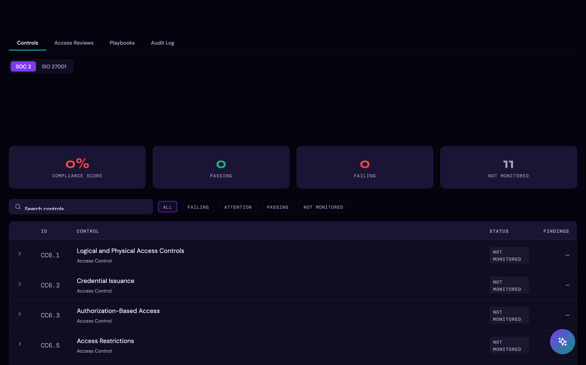
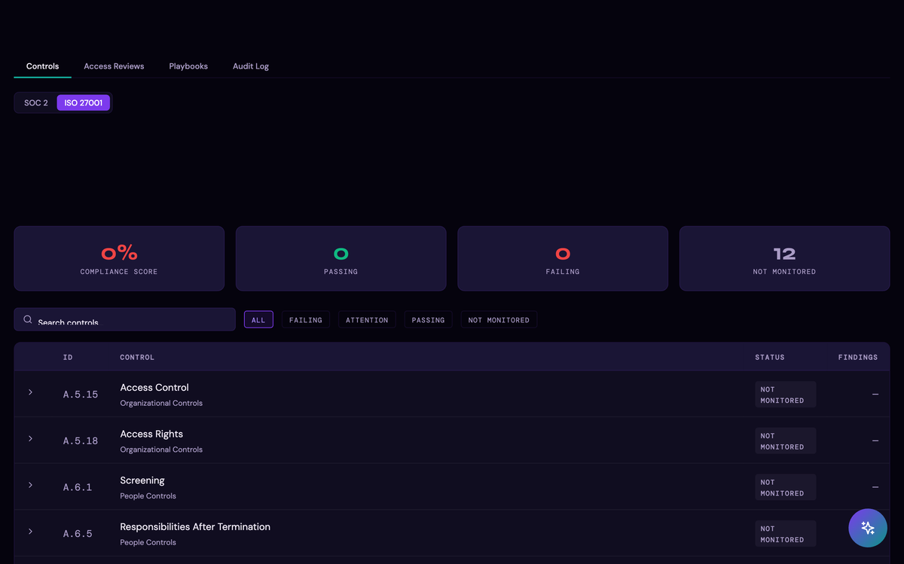

# Compliance

The Compliance page maps Thalian's findings and controls directly to SOC 2 Type II and ISO 27001 requirements — so your team can see at a glance which controls are covered, which are at risk, and what evidence Thalian has already collected.

---

## What is the Compliance page?

The Compliance page (`/compliance`) translates Thalian's raw findings into control-level coverage across two frameworks:

- **SOC 2 Type II** — Trust Services Criteria (Security, Availability, Confidentiality, Processing Integrity, Privacy)
- **ISO 27001** — Annex A controls

For each control, Thalian shows:

- **Status** — Passing, Failing, Attention, or Not Monitored
- **Related findings** — open findings that affect this control's compliance posture
- **Evidence** — links to the data Thalian has collected that supports the control (audit logs, identity records, device compliance status, etc.)

---

## Availability

The Compliance page is available on **Pro and Enterprise** plans. It is accessible to users with the **Security Analyst**, **Admin**, **Super Admin**, or **Auditor** role.

---

## SOC 2 coverage

Thalian maps its findings across the five Trust Services Criteria:

### CC6 — Logical and Physical Access Controls

| Control | What Thalian monitors |
|---|---|
| CC6.1 — Logical and Physical Access Controls | MFA enforcement across all connected IDPs and SaaS apps |
| CC6.2 — Credential Issuance | User provisioning, admin elevation, service account and shared account detection |
| CC6.3 — Authorization-Based Access | Role-based access, OAuth scope management, privilege drift across platforms |
| CC6.5 — Access Restrictions | Stale accounts, dormant admins, ghost entitlements, departed user access |
| CC6.6 — Threats and Vulnerabilities | Endpoint protection, EDR coverage, infected devices, OS currency, admin devices without management |
| CC6.7 — Access Removal Upon Termination | Terminated user access detection across all connected platforms |
| CC6.8 — Access Review | Periodic access review coverage — stale admins, unused entitlements, dormant OAuth apps, license clawback |

### CC7 — System Operations

| Control | What Thalian monitors |
|---|---|
| CC7.2 — Anomaly Monitoring | Behavioral anomaly detection, unusual login patterns, off-hours activity, mailbox forwarding rules |
| CC7.3 — Anomaly Evaluation | Drift signal analysis — MFA coverage decline, admin sprawl expansion, compliance degradation |

### CC8 — Change Management

| Control | What Thalian monitors |
|---|---|
| CC8.1 — Change Management | Integration sync health, audit trail with SHA-256 tamper detection |

### CC9 — Risk Management

| Control | What Thalian monitors |
|---|---|
| CC9.1 — Risk Mitigation | Cross-platform risk correlation, shadow IT detection, privilege accumulation, departing user data access |

---

## ISO 27001 coverage

Thalian maps findings to 12 Annex A controls across organizational, people, physical, and technological domains:

### Organizational Controls

| Annex A Control | What Thalian monitors |
|---|---|
| A.5.9 — Inventory of Information and Other Associated Assets | Shadow IT discovery, unvetted applications, unmanaged devices, EDR coverage gaps |
| A.5.15 — Access Control | IDP-to-SaaS entitlement coverage and gaps, MFA enforcement, SSO bypass detection |
| A.5.18 — Access Rights | Privilege minimization, admin sprawl, privilege accumulation, ghost entitlements, cross-platform privilege drift |
| A.5.23 — Information Security for Use of Cloud Services | OAuth scope management, scope creep detection, dormant OAuth apps, excessive app grants |

### People Controls

| Annex A Control | What Thalian monitors |
|---|---|
| A.6.1 — Screening | Users not found in identity provider, service account human pattern detection, shared account detection |
| A.6.5 — Responsibilities After Termination | Offboarding gaps, departed user entitlements, cross-platform terminated user access |

### Physical Controls

| Annex A Control | What Thalian monitors |
|---|---|
| A.7.9 — Security of Assets Off-Premises | Unmanaged devices, unencrypted endpoints, end-of-life OS versions, stale MDM check-ins |

### Technological Controls

| Annex A Control | What Thalian monitors |
|---|---|
| A.8.1 — User Endpoint Devices | Admin devices without compliance, EDR coverage, infected devices, CrowdStrike/SentinelOne sensor health |
| A.8.2 — Privileged Access Rights | Admin MFA enforcement, stale admins, admin excessive OAuth, admin elevation bursts |
| A.8.5 — Secure Authentication | MFA coverage gaps, department-level MFA gaps, MFA regression, MFA coverage decline trends |
| A.8.15 — Logging | Integration sync health, audit trail with SHA-256 tamper detection |
| A.8.16 — Monitoring Activities | Behavioral anomaly detection — login frequency, location diversity, off-hours activity, failed authentication, mailbox forwarding rules |

---

## Using compliance status in reviews

The Compliance page is designed to be used alongside your access reviews and audit preparation:

- **Before an audit:** run the Compliance page to identify controls that have open findings — these are the areas an auditor is most likely to probe
- **During an access review:** link your Access Review campaign decisions as evidence against CC6.7 (terminated user access), CC6.8 (access review), and A.5.18 (access rights)
- **For a penetration test prep:** use the At Risk controls to prioritize remediation before external testing begins

---

## Exporting compliance evidence

Each control in the Compliance page has an **Export Evidence** option that generates a summary of:

- Control description
- Thalian's coverage status
- Supporting data (finding count, affected entities, last sync timestamp)
- Links to related audit log entries

This output can be attached directly to audit request responses or included in a security review package.

---

*For information on running structured access certifications, see [Access Reviews](./access-reviews.md).*
*For information on Thalian's own security posture, see [Information Security Policy](./information-security-policy.md).*
