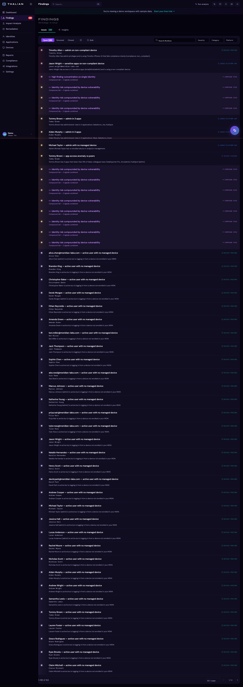
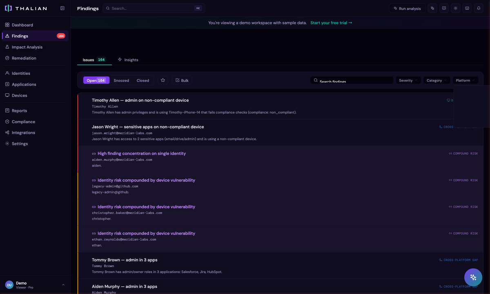
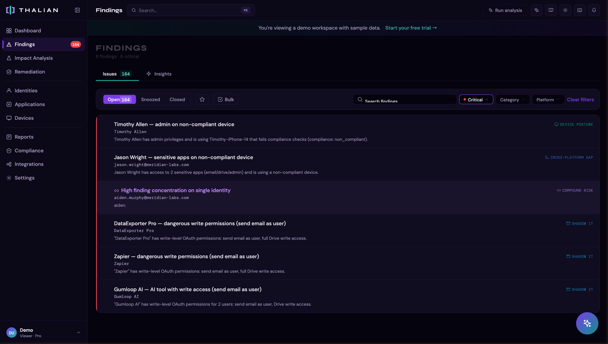
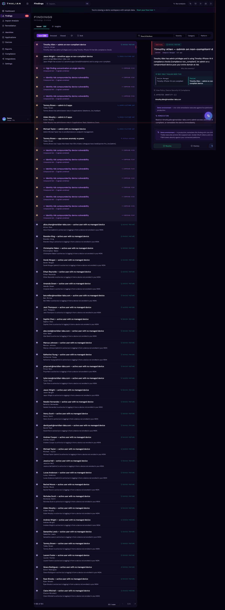
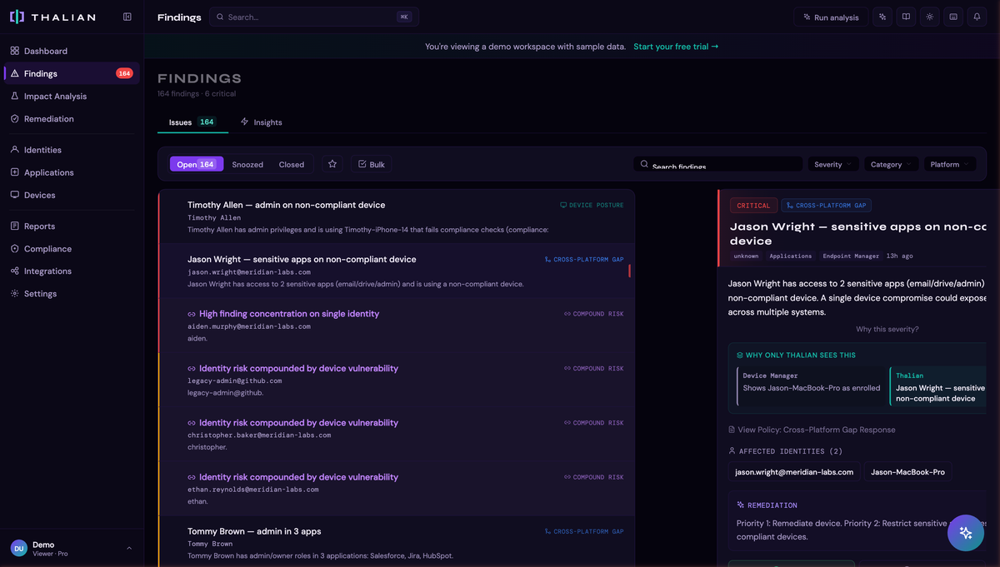
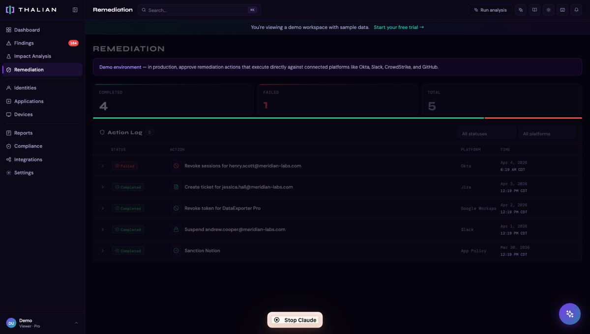

# Findings & Remediation Guide

Findings are the core unit of intelligence in Thalian. Each finding is a named insight expressed as a plain-language sentence with a subject and a consequence — not a raw data table row.

---

## What Are Findings?

A finding is something Thalian's analysis engine has detected that your IT team should know about. Examples:

- *"Sarah Chen has admin access to Salesforce but hasn't logged into Okta in 45 days."*
- *"3 users have MFA disabled across both Google Workspace and Okta."*
- *"Slack was discovered via email OAuth grants but is not in your sanctioned app list."*

Every finding has:
- A **subject** (who or what is affected)
- A **condition** (what's true)
- A **consequence** (why it matters)
- A **severity** (critical, high, medium, low)
- A **category** (what type of risk it represents)

## Analysis Engine

Thalian runs 295+ analysis rules across 11 categories every time data is synced:

| Category | What It Detects |
|---|---|
| **Identity Security** | MFA gaps, stale accounts, dormant admins, privilege anomalies, suspended users with active entitlements, platform-specific identity risks (Okta, Entra ID, Salesforce, etc.) |
| **Access Hygiene** | Over-provisioned access, unused entitlements, role mismatches between platforms, offboarding gaps, cloud IAM IDP gaps |
| **Shadow IT** | Unvetted applications discovered via OAuth grants, email analysis, or cross-platform observation, AI tool data access detection |
| **Device Posture** | Non-compliant devices, missing encryption, stale MDM check-ins, end-of-life operating systems, EDR coverage gaps |
| **License Waste** | Assigned licenses with no recent usage, duplicate subscriptions across platforms, cost-per-active-user analysis |
| **Compound Risk** | Risks that span multiple platforms — e.g., admin on an unmanaged device, terminated user with dual exfiltration vectors |
| **Drift Signal** | Changes in security posture over time — MFA coverage dropping, shadow IT count rising, compliance degrading |
| **Behavioral Anomaly** | Unusual login patterns, off-hours activity spikes, failed authentication bursts, sudden app access changes vs per-user baselines |
| **Access Risk** | Cloud IAM privilege analysis — GCP owner sprawl, AWS root account usage, Azure service principal risks |
| **Configuration** | Platform configuration issues — security defaults disabled, weak password policies, permissive session settings |
| **Finding Correlation** | Automatically correlated findings that share the same affected entity across platforms |

The cross-platform join is the key differentiator. Thalian correlates data across disconnected systems to surface insights that no single tool can produce — for example, an identity that's been deactivated in Okta but still has active entitlements in Google Workspace.

## Finding Lifecycle

```
Open → In Progress → Resolved
                   → Dismissed (with reason)
Open → Snoozed (temporary hide, auto-reopens)
```

- **Open:** Newly detected, needs attention
- **In Progress:** Someone is actively working on it
- **Resolved:** The underlying issue has been fixed (manually or via remediation action)
- **Dismissed:** Intentionally accepted or determined to be a false positive
- **Snoozed:** Temporarily hidden for a set period, then automatically resurfaces

## Severity Levels

| Severity | Score Weight | Description |
|---|---|---|
| **Critical** | 10 | Immediate security risk requiring urgent action |
| **High** | 5 | Significant risk that should be addressed soon |
| **Medium** | 2 | Moderate risk worth monitoring and planning for |
| **Low** | 1 | Minor issue or informational finding |

The **Security Posture score** on the dashboard uses a sigmoid normalization of the weighted sum. The raw score (Critical×10 + High×5 + Medium×2 + Low×1) is passed through the formula `90 × (1 − e^(−raw/25))`, capped at 100. This means a handful of critical findings produces a meaningful score increase, but the curve flattens as findings accumulate — preventing a single bad week from pegging the score at 100.

## Browsing Findings

The Findings page (`/findings`) provides a filterable, searchable list of all findings:



### Filtering by Severity

Use the **Severity** dropdown to narrow findings to a specific risk level. Click the dropdown to see counts for each severity:



Select a severity to filter the list. Here, filtering to **Critical** shows only the most urgent findings:



### Filters
- **Status tab:** Open, Resolved, Dismissed
- **Severity:** Critical, High, Medium, Low
- **Category:** Identity Security, Access Hygiene, Shadow IT, Device Posture, License Waste, Compound Risk, Drift Signal, Behavioral Anomaly, Access Risk, Configuration
- **Entity type:** Identity, Application, Device, Signal
- **Platform:** Filter by source platform
- **Search:** Free-text search across finding titles and affected entities

### Finding Detail Panel

Click any finding to expand its detail panel, which shows:



- Full finding description (the sentence-based insight)
- Affected entities with details
- Source platform(s) and the **cross-platform perspective view** — showing what each connected platform sees independently vs. what Thalian sees by combining them
- Available remediation actions



- Causality insights (related findings across platforms)
- What-if simulation preview (impact of acting on this finding)
- Linked policy (if a matching policy template exists)

## Remediation

### Available Actions

Thalian supports 40+ remediation action templates across several categories:

**Identity actions:**
| Action | Description |
|---|---|
| Suspend user | Temporarily disable account access |
| Unsuspend user | Restore account access |
| Force password change | Require new password on next login |
| Force MFA enrollment | Require MFA setup on next login |
| Enable MFA (org-wide) | Enforce MFA across the organization |
| Revoke OAuth token | Invalidate a specific OAuth grant |
| Revoke all tokens | Invalidate all active tokens |
| Revoke sessions | End all active sessions |
| Deactivate user | Permanently deactivate account |
| Offboard user | Composite: suspend + revoke sessions + revoke tokens |
| Remove admin role | Demote admin without suspending |
| Revoke license | Reclaim license assignment |
| Remove from group | Remove user from a specific group |
| Rotate credentials | Force credential rotation |
| Deprovision user | Remove user from platform entirely |
| Reconcile identities | Align identity records across platforms |

**Application actions:**
| Action | Description |
|---|---|
| Sanction app | Mark as approved/vetted |
| Block app | Block application access |
| Flag as unauthorized | Mark as shadow IT |
| Revoke shadow IT | Remove OAuth grants for shadow apps |
| Review app adoption | Investigate low-usage applications |
| Consolidate apps | Merge duplicate functional applications |
| Flag for renewal | Mark application contract for renewal review |

**Device actions:**
| Action | Description |
|---|---|
| Sync device | Trigger MDM policy sync |
| Remote lock | Lock device remotely |
| Retire device | Wipe and remove from management |
| Enroll device | Send MDM enrollment invite |
| Contain host | Isolate from network (CrowdStrike/SentinelOne) |
| Lift containment | Remove network isolation |

**Investigation & review actions:**
| Action | Description |
|---|---|
| Review SSO coverage | Investigate direct-auth apps bypassing SSO |
| Investigate behavioral anomaly | Review unusual access patterns |
| Investigate risky sign-in | Review flagged authentication events |
| Investigate departing user | Review access for departing employees |
| Investigate external sharing | Review external sharing activity |
| Review access | General access review for over-provisioned users |
| Revoke collaboration access | Remove external sharing or collaboration privileges |

**Other:**
| Action | Description |
|---|---|
| Create ticket | Create an ITSM ticket for the finding |
| Email vendor | Compose email to SaaS vendor (renewal, cancellation, etc.) |



### Approval Workflow

Not all actions execute immediately. The approval workflow depends on role and action severity:

1. **Agent** initiates a remediation action
2. If the finding is **high or critical severity**, the action enters a **pending approval** queue
3. A **Security Analyst**, **Admin**, or **Super Admin** reviews and approves (or rejects) the action
4. On approval, the action is executed against the target platform's API

Security Analysts and above can both initiate and approve actions without requiring a second approver.

### Agentic Execution

For Pro and Enterprise workspaces, Thalian supports automated remediation with three tiers:

| Tier | Behavior | Actions |
|---|---|---|
| **auto_execute** | Executes immediately without human review | Create ticket, notify user, sync device, sanction app |
| **auto_queue** | Queued for approval before execution | Suspend user, block app, revoke OAuth token |
| **never** | Always requires manual initiation | Retire device, deactivate user, remote lock |

Agentic policies are configurable in Settings > General.

### What-If Simulation

Before taking action, you can preview the impact:

1. On any finding's detail panel, look for the "What if you act on this?" section
2. The simulation shows: findings that would close, findings that might open, and the projected risk score change
3. This helps you prioritize actions by their actual impact on your security posture

## Causality Insights

When Thalian detects that findings are related across platforms, it surfaces **Causality Insights** — connections between findings that share the same affected entity. For example:

- A user flagged for "dormant Okta account" might also appear in "active Google Workspace admin" — revealing a cross-platform access gap
- An application flagged as shadow IT in one finding might also appear in a license waste finding

Click the linked finding chips to navigate between related findings.

---

*For information on tracking remediation actions over time, see [Reports & Audit](./reports-and-audit.md).*
