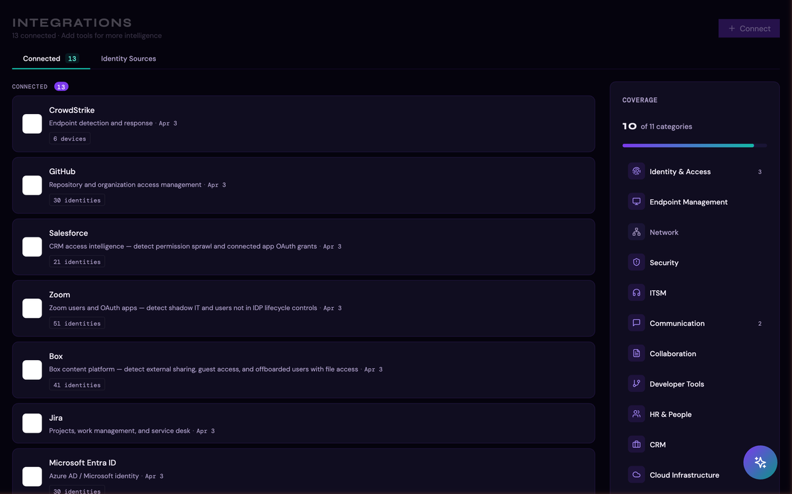
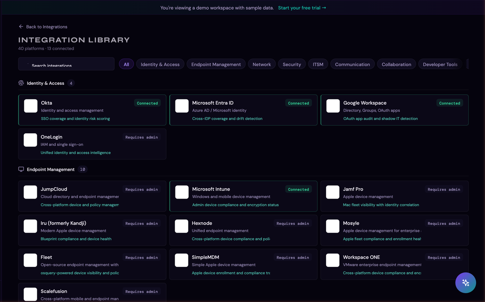
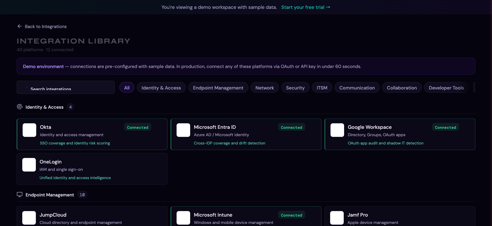

# Integrations Guide

Thalian's intelligence comes from the data it collects across your IT stack. The more platforms you connect, the more cross-platform insights Thalian can surface — things no single tool can see on its own.

---

## Supported Platforms

Thalian supports 40+ platforms across 11 categories:

### Identity & Access
| Platform | Auth Method | What It Syncs | Setup Guide |
|---|---|---|---|
| **Okta** | API token | Users, groups, MFA status, apps, system log events | [Connect Okta](./integrations/okta.md) |
| **Microsoft Entra ID** | OAuth or API | Users, groups, sign-in logs, enterprise apps, conditional access policies | [Connect Entra ID](./integrations/microsoft-entra-id.md) |
| **Google Workspace** | OAuth | Users, groups, OAuth apps, Gmail app discovery, audit events | [Connect Google Workspace](./integrations/google-workspace.md) |
| **JumpCloud** | API key | Users, devices, systems, policies | [Connect JumpCloud](./integrations/jumpcloud.md) |
| **OneLogin** | Client credentials | Users, apps, roles | [Connect OneLogin](./integrations/onelogin.md) |
| **PingOne** | API credentials | Users, groups, authentication policies, MFA policy, IDP gap detection | [Connect PingOne](./integrations/ping-identity.md) |

### Endpoint Management
| Platform | Auth Method | What It Syncs | Setup Guide |
|---|---|---|---|
| **Microsoft Intune** | OAuth or API | Devices, compliance status, configurations | [Connect Intune](./integrations/microsoft-intune.md) |
| **Jamf Pro** | API credentials | Mac/iOS devices, compliance, configurations | [Connect Jamf Pro](./integrations/jamf-pro.md) |
| **Iru (formerly Kandji)** | API token | Apple devices, blueprints, compliance | [Connect Iru](./integrations/kandji.md) |
| **Hexnode** | API key | Cross-platform devices, policies | [Connect Hexnode](./integrations/hexnode.md) |
| **Mosyle** | API credentials | Apple devices, compliance, policies | [Connect Mosyle](./integrations/mosyle.md) |
| **Fleet** | API token | Cross-platform endpoints, policy results, host inventory | [Connect Fleet](./integrations/fleet.md) |
| **SimpleMDM** | API key | Apple devices, profiles, compliance | [Connect SimpleMDM](./integrations/simplemdm.md) |
| **Omnissa Workspace ONE** | API credentials | Cross-platform devices, compliance status | [Connect Workspace ONE](./integrations/workspace-one.md) |
| **Scalefusion** | API key | Cross-platform devices, policies, compliance | [Connect Scalefusion](./integrations/scalefusion.md) |

### Security
| Platform | Auth Method | What It Syncs | Setup Guide |
|---|---|---|---|
| **CrowdStrike** | API credentials | Endpoints, detections, containment status | [Connect CrowdStrike](./integrations/crowdstrike.md) |
| **SentinelOne** | API token | Agents, threats, device health | [Connect SentinelOne](./integrations/sentinelone.md) |

### Network
| Platform | Auth Method | What It Syncs | Setup Guide |
|---|---|---|---|
| **Cisco Meraki** | API key | Network devices, clients, VPN status | [Connect Cisco Meraki](./integrations/cisco-meraki.md) |
| **Auvik** | API key | Network devices, networks, clients, alerts | [Connect Auvik](./integrations/auvik.md) |

### ITSM (IT Service Management)
| Platform | Auth Method | What It Syncs | Setup Guide |
|---|---|---|---|
| **Jira** | OAuth or API | Issues, users, service requests, agents | [Connect Jira](./integrations/jira.md) |
| **ServiceNow** | API credentials | Incidents, users, CMDB items | [Connect ServiceNow](./integrations/servicenow.md) |
| **Freshservice** | API key | Tickets, agents, assets | [Connect Freshservice](./integrations/freshservice.md) |
| **Zendesk** | API token | Tickets, users, organizations | [Connect Zendesk](./integrations/zendesk.md) |

### Communication
| Platform | Auth Method | What It Syncs | Setup Guide |
|---|---|---|---|
| **Slack** | OAuth | Users, guest accounts, alert delivery (finding notifications to channels) | [Connect Slack](./integrations/slack.md) |
| **Slack Enterprise Grid** | OAuth | Enterprise audit logs, cross-workspace user management | [Connect Slack](./integrations/slack.md) |
| **Microsoft Teams** | OAuth or webhook | Audit events, alert delivery (adaptive card notifications) | [Connect Teams](./integrations/microsoft-teams.md) |
| **Microsoft Outlook** | OAuth | Mailbox monitoring, forwarding rule detection | [Connect Outlook](./integrations/microsoft-outlook.md) |

### Collaboration
| Platform | Auth Method | What It Syncs | Setup Guide |
|---|---|---|---|
| **SharePoint** | OAuth | Sites, external sharing, document permissions | [Connect SharePoint](./integrations/sharepoint.md) |
| **Confluence** | OAuth or API | Spaces, external sharing, content exposure | [Connect Confluence](./integrations/confluence.md) |

### Developer Tools
| Platform | Auth Method | What It Syncs | Setup Guide |
|---|---|---|---|
| **GitHub** | OAuth | Org members, outside collaborators, repositories, IDP gap detection | [Connect GitHub](./integrations/github.md) |
| **GitLab** | Group Access Token | Group members, projects, deploy keys, IDP gap detection | [Connect GitLab](./integrations/gitlab.md) |
| **Datadog** | API + App key | Users, admin roles, IDP gap detection, offboarded user access | [Connect Datadog](./integrations/datadog.md) |

### HR & People
| Platform | Auth Method | What It Syncs | Setup Guide |
|---|---|---|---|
| **Rippling** | API key | Employee lifecycle data, departments, managers, terminated access detection | [Connect Rippling](./integrations/rippling.md) |
| **BambooHR** | API key | Employee lifecycle data, departments, managers, terminated access detection | [Connect BambooHR](./integrations/bamboohr.md) |
| **Workday** | API credentials | Employee lifecycle data, departments, managers, terminated access detection | [Connect Workday](./integrations/workday.md) |

### CRM
| Platform | Auth Method | What It Syncs | Setup Guide |
|---|---|---|---|
| **Salesforce** | OAuth | Users, connected apps, OAuth tokens, IDP gap detection | [Connect Salesforce](./integrations/salesforce.md) |

### Cloud Infrastructure
| Platform | Auth Method | What It Syncs | Setup Guide |
|---|---|---|---|
| **Google Cloud IAM** | OAuth | GCP project members, IAM bindings, IDP gap detection | [Connect GCP IAM](./integrations/gcp-iam.md) |
| **AWS IAM** | Access key | IAM users, access keys, MFA status, IDP gap detection | [Connect AWS IAM](./integrations/aws-iam.md) |
| **Azure IAM** | OAuth | Role assignments, service principals, IDP gap detection | [Connect Azure IAM](./integrations/azure-iam.md) |

### Productivity
| Platform | Auth Method | What It Syncs | Setup Guide |
|---|---|---|---|
| **Zoom** | OAuth | Users, admin settings, SSO enforcement status, IDP gap detection | [Connect Zoom](./integrations/zoom.md) |
| **Box** | OAuth | Users, admin events, external sharing activity, IDP gap detection | [Connect Box](./integrations/box.md) |

### Outbound
| Platform | Auth Method | What It Syncs | Setup Guide |
|---|---|---|---|
| **Webhook** | HTTPS endpoint | Outbound finding delivery (no read access needed) | [Outbound Webhooks](./integrations/webhooks.md) |

## Browsing the Integration Library

Click **Browse** on the Integrations page to open the full library of supported platforms, organized by category:

## Connecting an Integration

### OAuth Platforms (Google Workspace, Entra ID, Intune, Slack, Jira, etc.)

1. Go to **Integrations** in the sidebar
2. Click **Browse** to open the integration library, or find the platform card
3. Click **Connect**
4. You'll be redirected to the platform's consent screen
5. Authorize the requested permissions (Thalian requests read-only scopes)
6. You'll be redirected back to Thalian — the integration is now connected

**Note:** Some OAuth platforms may not grant all requested scopes. Thalian detects this and shows a warning about which features are degraded. You can reconnect to grant additional scopes at any time.

### API Key Platforms (Okta, JumpCloud, CrowdStrike, etc.)

1. Go to **Integrations** → **Browse**
2. Find the platform and click **Connect**
3. Enter the required credentials (API token, domain, etc.)
4. Click **Save** — Thalian validates the credentials and connects

**Credentials are encrypted** at rest before storage and are never exposed in plaintext.

## Syncing Data

### Manual Sync

Click the **Sync** button on any integration card to trigger an immediate data pull. The sync status shows real-time progress.

### Automatic Sync

Connected integrations are synced automatically on a regular schedule without any manual intervention.

### What Happens During a Sync

1. Thalian pulls the latest data from the platform's API
2. New records are inserted; changed records are updated; removed records are deleted
3. The sync engine diffs incoming data against existing records — only changed rows are touched
4. After sync, the analysis engine runs automatically to generate new findings

## Alert Rules

For communication platforms (Slack, Teams) and ITSM platforms (Jira, ServiceNow, Freshservice, Zendesk), you can configure alert rules:

- **Toggle alerts on/off** directly from the integration card
- When enabled, new findings above a configured severity threshold are automatically sent to the connected channel or ticketing system
- Slack and Teams receive formatted messages; ITSM platforms get tickets created automatically

## Plan Limits

The Free plan includes up to 3 integrations and 25 identities. When you exceed the integration limit, the oldest integrations are automatically paused. Upgrade to Pro to reconnect them.

For a full plan comparison, see [Settings & Admin](./settings-and-admin.md).

## Managing Integrations

- **Pause:** Temporarily stop syncing without losing the connection. Data is retained
- **Reconnect:** Re-authorize OAuth or update API credentials if they've expired
- **Disconnect:** Stop syncing and remove credentials. Synced data (identities, apps, devices, findings) is retained — the integration shows as disconnected but its data remains until your retention window expires
- **Remove:** Permanently delete the integration and all synced data. Findings are anonymized and preserved for audit trail purposes, but entity records are deleted immediately

## Troubleshooting

- **Sync errors:** Check the integration card for error indicators. Common causes: expired API token, revoked OAuth consent, rate limiting
- **Missing data:** Ensure the API credentials have sufficient permissions. Some platforms require admin-level tokens for full directory access
- **Scope warnings:** If you see "limited scope" warnings after OAuth, reconnect and grant the additional permissions

---

*For information on what Thalian does with your synced data, see [Findings & Remediation](./findings-and-remediation.md).*
