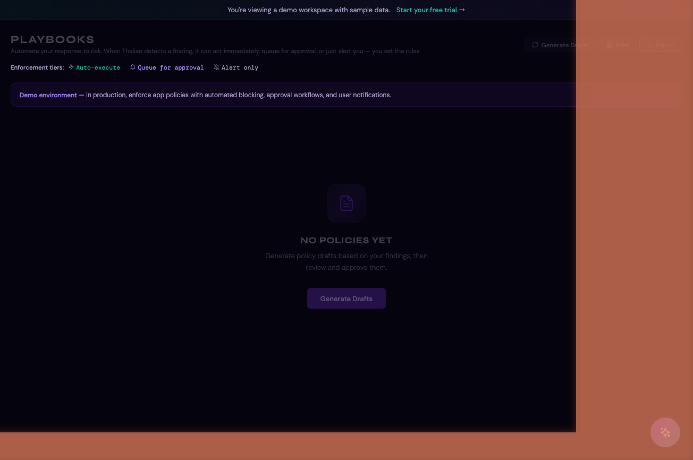
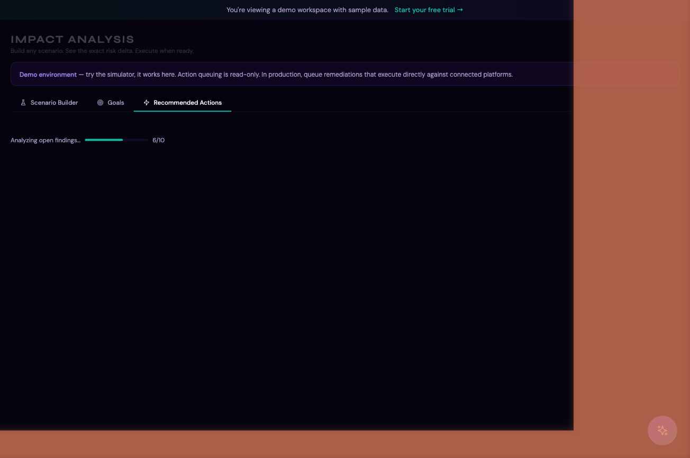

# Policies & Impact Analysis Guide

Thalian includes tools for documenting security policies tied to your actual findings, and for simulating the impact of remediation actions before you take them.

---

## Policies Page



The Policies page (`/policies`) provides auto-generated policy and procedure documents based on your workspace's connected integrations and active findings.

### How It Works

1. **Auto-generation:** Thalian creates policy drafts based on your connected platforms, active findings, and analysis rules. Each policy is tied to a specific security concern (e.g., "MFA Enforcement Policy," "Shadow IT Acceptable Use Policy")
2. **Review workflow:** Each policy starts as a draft and can be reviewed, edited, and approved
3. **Customization:** Edit any policy's title and body directly in the app. Changes are saved to your workspace
4. **Context-aware:** Policy bodies reference your actual platform names, thresholds, and workspace configuration — not generic templates

### Policy Lifecycle

```
Draft → Approved (after review)
      → Dismissed (if not needed)
```

### Features

- **Search:** Find policies by keyword
- **Filter by category:** Filter to specific finding categories (identity security, shadow IT, etc.)
- **Filter by status:** View all, drafts only, or approved only
- **Linked findings:** Each policy shows the findings that triggered its generation. Click to navigate to the finding
- **Export to PDF:** Download individual policies as formatted PDF documents for distribution or compliance evidence
- **Print:** Print policies directly from the browser

### Best Practice

1. Connect your integrations and run an analysis
2. Go to the Policies page — Thalian will auto-generate relevant drafts
3. Review each draft, edit as needed for your organization's specific requirements
4. Approve finalized policies
5. Export approved policies as PDF for your compliance documentation or team distribution

---

## Impact Analysis Page



The Impact Analysis page (`/impact-analysis`) helps you model remediation scenarios before executing them, and track progress toward security goals.

### Scenario Builder

The scenario builder lets you answer "what if?" questions:

1. **Add actions to your plan:** Select from action types (enable MFA, suspend user, sanction app, etc.) and pick specific entities to act on
2. **Run simulation:** Thalian calculates what would happen if you executed all planned actions:
   - How many findings would close
   - How many new findings might open (if any)
   - What the risk score would change to
   - Breakdown by severity
3. **Compare before vs. after:** See your current score alongside the simulated score
4. **Downstream impact:** View which specific findings would be affected and how

**Action types available for simulation:**

| Category | Actions |
|---|---|
| Identity | Enable MFA, Suspend user, Offboard user, Remove admin role, Revoke license, Remove from group, Rotate credentials |
| Application | Sanction app, Flag as unauthorized, Revoke shadow IT, Revoke OAuth token |
| Device | Enroll device |

### KPI Dashboard

The KPI Dashboard shows goal progress at a glance:

- **Goal status cards:** Each goal shows current value, target value, progress bar, and deadline
- **Status indicators:** On track (green), At risk (yellow), Achieved (check), Missed (red)
- **Velocity tracking:** Based on the rate of progress so far, Thalian predicts whether you'll hit the target by the deadline
- **Scenario links:** See which planned scenarios in the builder would help advance each goal

### Goals Tracker

Create and manage measurable security goals (OKRs):

**Available metrics (14 total):**

| Group | Metrics |
|---|---|
| Security Posture | Risk Score, MFA Coverage, Device Compliance, Disk Encryption, SSO Coverage |
| Operational | Stale Accounts, License Waste, Shadow IT Apps, Open Findings, Unmanaged Devices |
| Performance | MTTR (All), MTTR (Critical) |

**Creating a goal:**
1. Click "Add Goal"
2. Select a metric to track
3. Set your target value (e.g., "MFA Coverage above 95%")
4. Set a deadline
5. Thalian records the baseline value automatically

**Goal progress** is computed by comparing the current metric value against the baseline and target. Thalian tracks velocity (rate of improvement) and predicts whether you'll hit the goal by the deadline.

**AI recommendations:** Each goal includes an AI assistant that can suggest actions to help you reach the target faster, based on your current findings and available remediation actions.

### Workflow: Scenario Builder + Goals

The scenario builder and goals tracker work together:

1. **Set goals** for your key security metrics (e.g., "Reduce risk score below 100 by end of Q2")
2. **Build scenarios** in the scenario builder to model which actions would have the biggest impact
3. **Check the KPI Dashboard** to see how each scenario would advance your goals
4. **Execute the most impactful actions** via the Findings or Remediation page
5. **Track progress** as subsequent analysis runs update your metric values

---

*For information on viewing remediation action history, see [Reports & Audit](./reports-and-audit.md).*
