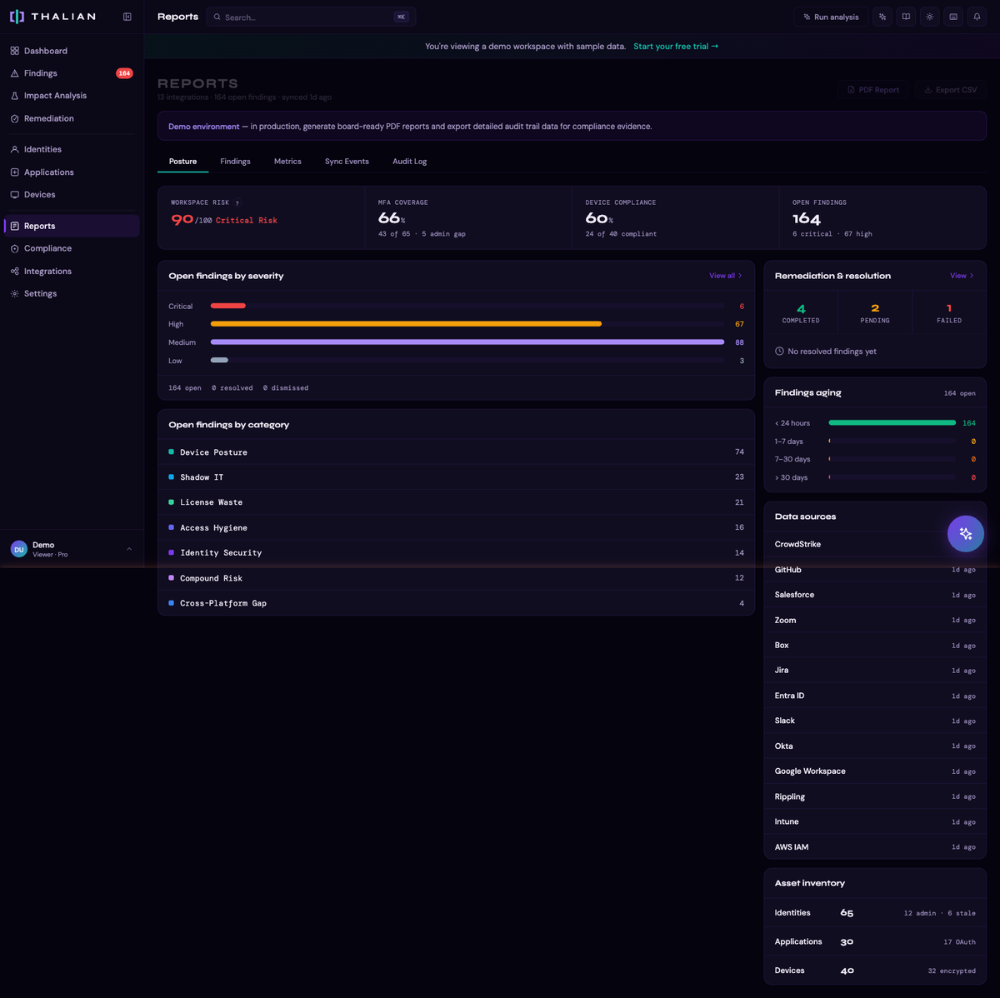
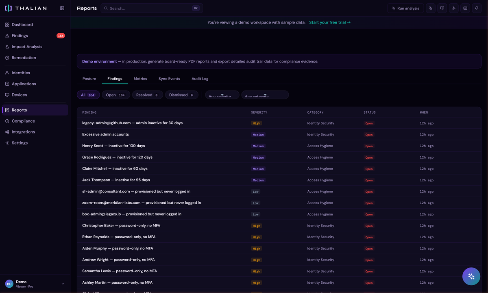

# Reports & Audit Guide

The Reports page (`/reports`) provides historical views of your security posture, operational metrics, sync activity, and a complete audit trail.

---

## Tabs

### Posture

The default view showing your workspace's security posture over time:

- **Posture score trend:** Historical risk score from drift snapshots, showing how your security posture has changed over time
- **Findings breakdown:** Open findings by severity and category
- **Coverage metrics:** MFA coverage, SSO adoption, device compliance percentages
- **AI Brief:** AI-generated summary of your current posture and notable changes. You can ask follow-up questions

### Findings

A historical view of finding activity:

- **Finding trends:** New findings opened vs. resolved over time
- **Category distribution:** Which rule categories are generating the most findings
- **Top recurring findings:** Rules that fire most frequently

### Metrics

Operational metrics for measuring IT security program effectiveness:

- **MTTR (Mean Time to Remediate):** Average time from finding detection to resolution
  - Overall MTTR across all findings
  - MTTR by severity (critical, high, medium, low)
  - Trend over time from drift snapshots
- **Remediation progress:** Actions completed, pending, and failed
- **Data source health:** Integration sync status and freshness

### Sync Events

A log of all data changes detected during syncs:

- **Event types:** Created, Updated, Deleted
- **Entity types:** Identity, Application, Device
- **Details:** What changed, on which platform, and when
- Filterable by event type and entity type
- Paginated for large datasets

### Audit Log

Complete, immutable record of all actions taken in your workspace:

**Logged action types:**
- Integration events (connected, disconnected)
- Analysis runs (completed)
- Remediation actions (requested, approved, rejected, executed)
- App policy changes (sanctioned, blocked, cleared)
- Finding status changes (resolved, dismissed)
- Security settings (MFA enforcement, session timeout, IP allowlist)
- Team management (invited, joined, role changed, removed)
- Billing events (checkout, upgrade, cancellation, payment issues)
- Google security events (RISC events)

**Features:**
- **Filter by category:** All, Integrations, Remediation, Findings, Team, Billing, Settings, System, Security
- **Tamper-proof:** Every entry is SHA-256 hashed for integrity verification
- **Export:** Download the full audit log as JSON via the export button, for SIEM integration or compliance archival
- **Immutable:** Audit log entries are never deleted, regardless of workspace plan or data retention settings. Minimum 365-day retention guaranteed

## Risk Score Calculation

The risk score displayed on the dashboard and tracked in posture reports is calculated in two steps:

1. **Raw score:** `(Critical findings × 10) + (High × 5) + (Medium × 2) + (Low × 1)`
2. **Normalized score:** `90 × (1 − e^(−raw / 25))`, capped at 100

The sigmoid normalization means a handful of critical findings produces a meaningful score increase, but the curve flattens as findings accumulate — preventing a single bad week from pegging the score at 100. Only **open** findings (status: `open` or `in_progress`) are counted. Resolved and dismissed findings do not contribute to the score.

## Drift Snapshots

After each analysis run, Thalian captures a "drift snapshot" — a point-in-time record of key metrics:

- Open finding counts by severity
- MFA coverage percentage
- Device compliance percentage
- Shadow IT count
- MTTR (overall and critical)

These snapshots power the trend charts and allow you to see exactly when posture changed and by how much.

## AI Brief

Available on both the Dashboard and Reports pages, the AI Brief provides:

- Natural language summary of your workspace's security posture
- Highlights of notable changes since the last analysis
- Answers to follow-up questions about your data

The AI has access to your workspace's findings, identities, applications, devices, entitlements, and integration data. Ask questions like:

- *"Which admins haven't logged in recently?"*
- *"What shadow IT apps were discovered this week?"*
- *"How has our MFA coverage changed over the past month?"*

---

*For information on setting security goals and tracking progress, see [Policies & Impact Analysis](./policies-and-planning.md).*
